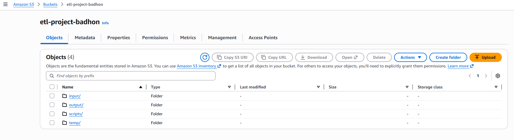
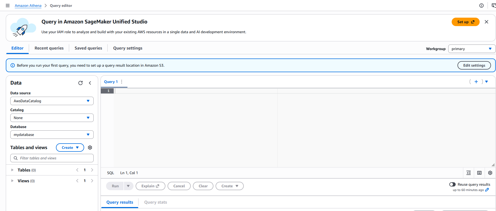
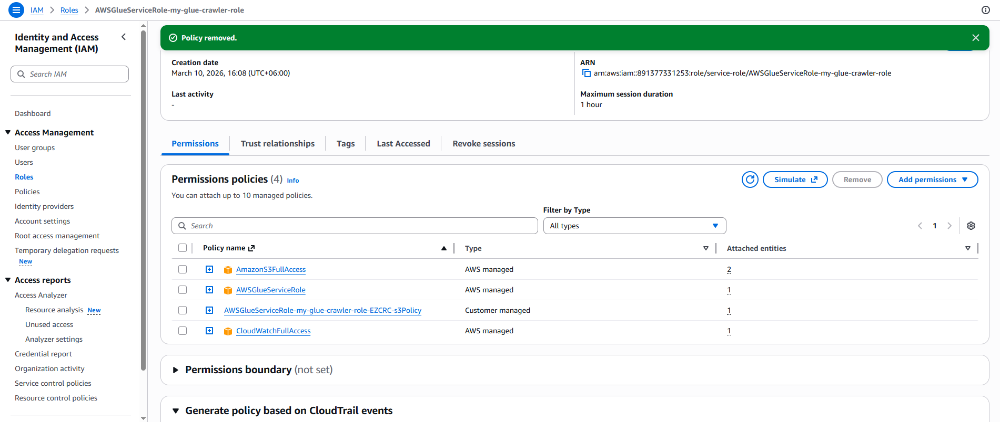
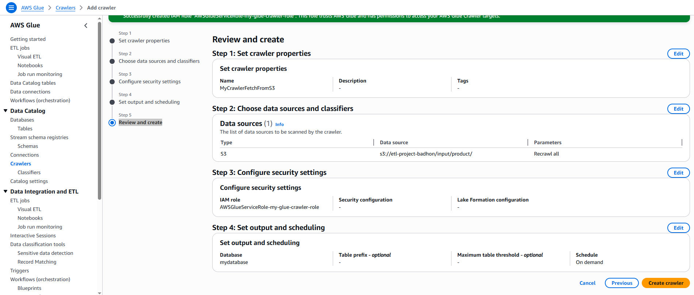
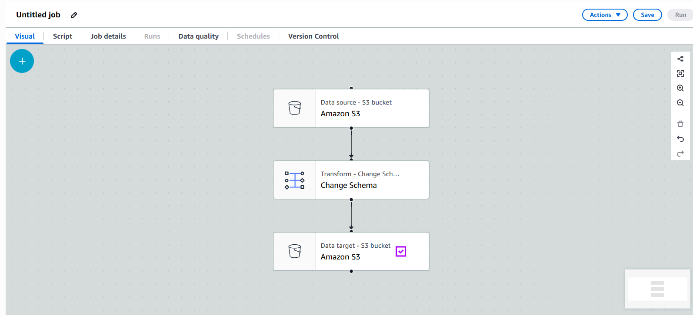

### AWS Glue

- AWS Glue provides a console and API operations to set up and manage your extract, transform, and load (ETL) workload.
- AWS Glue Console
  - Define AWS Glue objects such as jobs, tables, crawlers, and connections.
  - Schedule when crawlers run.
  - Define events or schedules for job triggers

### AWS crawler

- AWS Glue crawlers connect to your source or target data store, determine the schema for your data, and then creates metadata in your aws glue data catalog. the metadata is stored in tables in your data catalog
- crawler creates the metadata that allows glue and services such as athena to view the s3 information as a database with tables
- the crawler's default behavior is to perform an incremental update, this means that it will only append data from the new or modified files to the existing catalog tables, and it will not insert the data of old files again

### AWS Glue JOB (ETL)

- AWS Glue offers two ETL (Extract, Transform, Load) options for processing data : the Python Shell and Apache Spark.
- Python Shell : It is well-suited for scenarios where the data size is relatively small and doesn't require distributed processing.
- We can use popular Python libraries such as pandas, NumPy to perform data preprocessing.

- Apache Spark : AWS Glue also supports Apache Spark, a Powerful and distributed data processing framework.
- It offers high performance and scalability by leveraging distributed computing

### Project Structure

- Create Three crawler
  - MyCrawlerFetchFromS3
  - MyCrawlerFetchFromSRedshift
- Create Two ETL Job
  - MyGlueJobReadFromS3
  - MyGlueInsertRedshift

### Steps for crawler MyCrawlerFetchFromS3

- Read data from s3 using AW glue Crawler
- Create partition in s3 and upload file.
- Create a bucket with the folder
  - input/product/year=2026/product_data.csv
  - output
  - scripts
  - temp
- s3://myglue-etl-project/input/product/year=2021/product_data.csv
- Create crawler which reference path s3://myglue-etl-project/input/product/
- myglue-crawler-role IAM role have permission of s3 full access and cloudwatch fullaccess, AWSGlueServiceRole
- It will automatically create year column as partition column. you can see data in athena.
- If we add another folder year=2022, than we need run crawler again.
- s3://myglue-etl-project/input/product/year=2022/
- the crawler's default behavior is to perform an incremental update. This means that it will only append data from the new or modified filed to the existing catalog tables, and it will not insert the data of old files again

---

### Steps for crawler MyCrawlerFetchFromS3

- 1. First we need to create a s3 bucket named as etl-project-badhon
  - add 4 folder
    - input/product/year=2026/product_data.csv
    - output
    - scripts
    - temp
    - Image of S3 Bucket
  - 
- 2. Then we need to create a data base in Amazon Glue-> Data-Catalog -> Databases -> Create a Database Name mydatabase .
  - 
  - optional : Go to Amazon Athena and set the database to mydatabase .
    - 
- 3. No in Aws Glue Crawlers we need the set the crawler name with the data source link `input/product/year=2026` and Configure the IAM Role with this name `my-glue-crawler-role ` and set the 3 permission | AmazonS3FullAccess | AWSGlueServiceRole | CloudWatchFullAccess . And Set Output and scheduling with the target database name mydatabase and then Run
  - 
  - 

### Create Glue ETL MyGlueJobReadFroms3 job

- Create GLue etl job using pyspark
- Read data from product table which create by MyGlueJobReadFroms3 and convert into parquet format by glue etl
- Create output file in s3://my-glue-etl-project/output/
- Job name MyGlueJobReadFroms3
- Provide IAM role myglue-crawler-role
- We can give script path s3://my-glue-etl-project/scripts/
- The temporary path is s3://my-glue-etl-project/temp/

- Create Visual ETL 
  - 