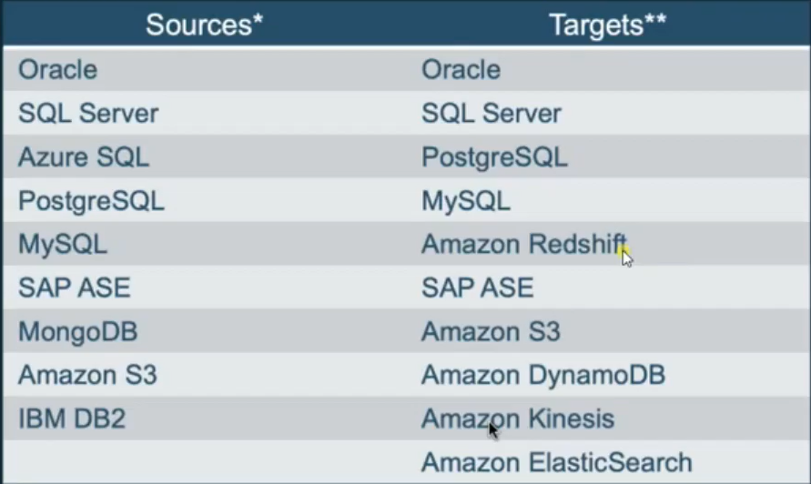

## AWS Data Migration Service

- Simple To Use
  - No Drivers or applications to install
  - No Changes to the source database in most cases
  - Just a few clicks to start a migration from the console
  - DMS manages the complexities of migration for you
  - Automatically replicate changes
  - can be used for continuous replication

- Minimal Downtime
  - Source
    - All Changes can be replicated to the target
    - Source database stays fully operational during the migration
  - Target
    - Target database stays in sync with the source for as long as you choose
    - Switch over when the target is fully sync'd and without lag

- Supports widely used databases
  

- Reliable
  - Highly resilient and self-healing
  - Continual Monitoring
    - Source and target databases
    - Network Connectivity
    - Replication instance
- In case of interruption the process is automatically restarted and the migration continues from where it was halted.
- Multi-AZ option for high availability.

- **Database Migration Service Components**
  - Endpoint
    - Endpoint is a **_set of configuration_** which allows the DMS service to get to know where your target is and how it connect to source and target
  - Replication instance
  - Task
