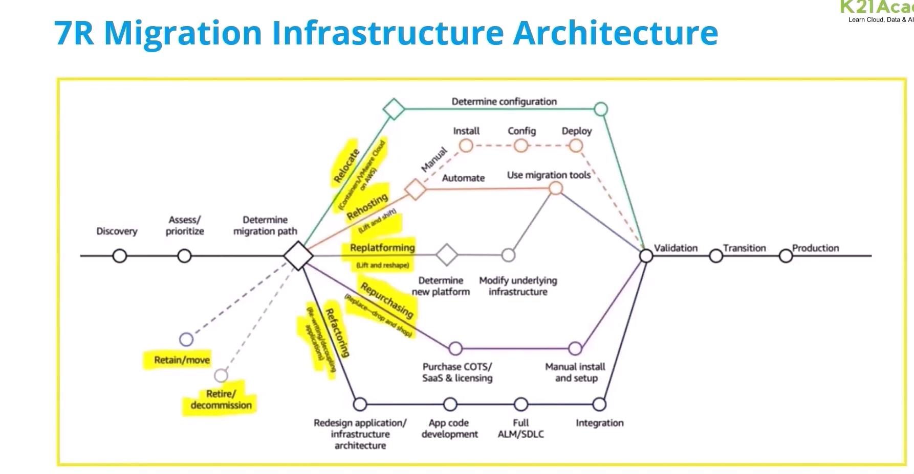

### Migration In AWS.

What is Migration?

- Migration is the process of moving from one platform to another, it can be migrating a web-based application, databases, virtual machines, and so on.
- Database migration is a complex, multiphase process, which usually includes the following:
  - Assessment of the migration task
  - Database Schema Conversion
  - Script Conversion
  - Data Migration
  - Functional Testing
  - Performance Tuning

### 7R's of Migration

1. Rehost - Lift and Shift. | Easy to migrate
   - Server 01 in on-prem --> Copy it to AWS and run it as a server. OS/App/Configuration/Setting remains the same.
2. Re-platform - It runs another type of platform? | Small changes required
   - SQL DB Server in on-prem and Iwant to move to cloud? SQL server on managed DB's PaaS/DBaaS.
   - PostgreSQL : Linux Server onprem.
   - PSQL on RDS : Same DB running on a manged platform.
3. Refactor (Re-architect) | Maximum changes - Lot of effort required
   - .Net 2.0 application which I wrote in 2013, Windows licensing.
   - . Net application core (Linux), containerize
   - AWS services like, ECS, EKS, Lambda
4. Relocate
   - VMWare servers, you move to VMware on AWS/Azure.
   - VMWare from Texas to California
5. Retain
   - Do nothing. continue to run as it is.
6. Repurchase

- Office suite, Word, Excel power, 0365, Salesforce, SAP.

7. Retire

- Decommission the servers, we don't need them anymore. Museum environment.

- Ms SQL server to Oracle/Postgres or any other RDBMS
  - Heterogeneous migration

---

### 7R Migration pattern

- **_Rehost (Lift & Shift)_** is a strategy of Re-hosting applications to AWS without making any changes to the on-premise application. One can use the AWS server migration service and AWS migration hub, containerize the application and then migrate it to AWS.
- **_Relocate (hypervisor-level lift & shift)_** is a strategy to move infrastructure to the cloud without purchasing new hardware, rewriting applications, or modifying your existing operations.
- **_Refactor_** is a strategy used for a need to add new features or in order to increase the scalability of the application or in order to boost your business continuity and productivity, most expensive strategy is usually executed after the initial migration via one of the approaches like Re-hosting
- **_Repurchase_** is the fastest way possible to access the cloud-based SaaS, it takes your company's existing data & applications and performs them clearly in a cloud-based product in order to manage operations such as HR, CRM, or CMS
- **_Re-platform (Lift, Tinker & Shift)_** when organizations have outdated structures to move into IaaS cloud platforms. Instead of Changing the core of the applications, they are emulated through a VM so that systems become compatible with modern-day cloud technologies without restructuring the systems
- **_Retain_** is a strategy to keep some elements in your on-premise which are not ready to migrate, focusing on Migrating what makes sense for the business.
- **_Retire_** is to identify the assets that are no longer useful and can be removed which helps in boosting your business case and giving attention towards maintaining the needful resources which can be widely used.

### 7R Migration Infrastructure Architecture

### AWS Well Architecture Framework

- AWS Well Architecture framework is a document created by AWS which can be used to design your AWS infrastructure architecture by using the appropriate services.
- Customer can apply their framework periodically on their target AWS environment
- This will help customers in delivering the following benefits
- Performance Efficiency and Scalability
- Security and Compliance
- Cost Optimization
- Operational Efficiency
- Reliability and Resiliency
- Sustainability

### AWS Migration Best Practices

- Start small and simple : Use AWS Services to get simple tasks done quick and quickly the more your staff becomes comfortable with AWS services, and the faster your stack holders see the benefits, the easier it is to convince them of the benefits of AWS.
- Automate : Automate extensively to realize the speed of cloud computing, spend time revisiting processes and establishing new ones that can be automated as you migrate
- Adaptive : Adjust your internal processes so that the stack holders are able to embrace this technological change and align themselves with this new paradigm.

### AWS Migration Best Practices

- Leverage Fully managed services wherever possible
- Let AWS handle the day-to-day maintenance activities and free up your team to focus on customers
- You can Monitor everything comprehensively and have data-driven insights into how the environmental performance and use them to make business decisions when considering trade-offs between performance and costs.

### Phases of migration

1.  Discovery/Assessment
    - Rehost, Re-platform, Retire, Refactor.
2.  Mobilise
    - VPC, Security Groups, creating the users/permissions/roles, budgets
3.  Migrate
    - Start the replication/migration/copying to the cloud provider.
    - Days/Weeks/Month.
    - Continue to use the source machines . business as usual
    - Cut-over
      - failover from on-prem to cloud machine ...
      - failover --> rollback from cloud to onprem .
        migration is successful.
4.  Optimise/Modernise.
    - Alerts, logging, revoke access, security, reliability, resilience.

---

# Data Migration To AWS

## Objectives

- After completing this module, you should be able to :
  - know about Data Migration to AWS
  - Understand the type of Data Migration Services provided by AWS and their working
  - Understand the use cases for the Data Migration services
  - Enable S3 transfer acceleration to accelerate the data transfer speed

## Introduction of Data Migration to AWS

- Data Migration to AWS
  - It is the process of moving data from onsite computers to AWS

- Data Migration Challenges
  - 1.  Amazon S3 Bucket Name Restrictions
  - 2.  AWS SSL Certificates and CloudFront
  - 3.  Defining Cache Policy With Amazon CloudFront
  - 4.  Data Consistency
  - 5.  Setting Up HTTP Headers
  - 6.  AWS S3 Security
  - 7.  Optimizing with S3 Storage Types

- Data Migration Services
  - Direct Connect
  - AWS Snowball
  - AWS Snowmobile
  - S3 Transfer Acceleration
  - Storage Gateway
  - Snowball Edge
  - Kinesis Firehouse

- Direct Connect
  - Establish a dedicated network connection from the on-premise environment to AWS
  - Same connection can be used for both public and private resources

- AWS Snowball
  - It is a service that accelerates large data transfer in and out of aws using physical storage appliances or by internet bypassing
  - It provides powerful interfaces to create jobs, transfer data and track the status

---

# Storage Gateway

- AWS storage gateway is hybrid storage services?
