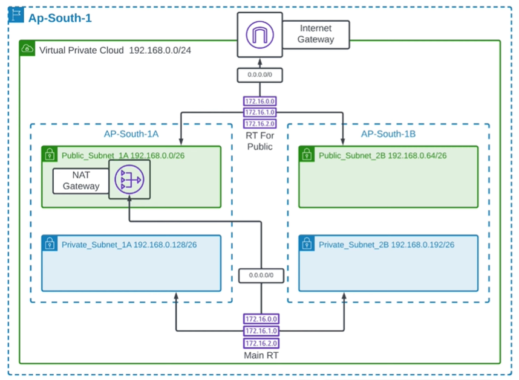
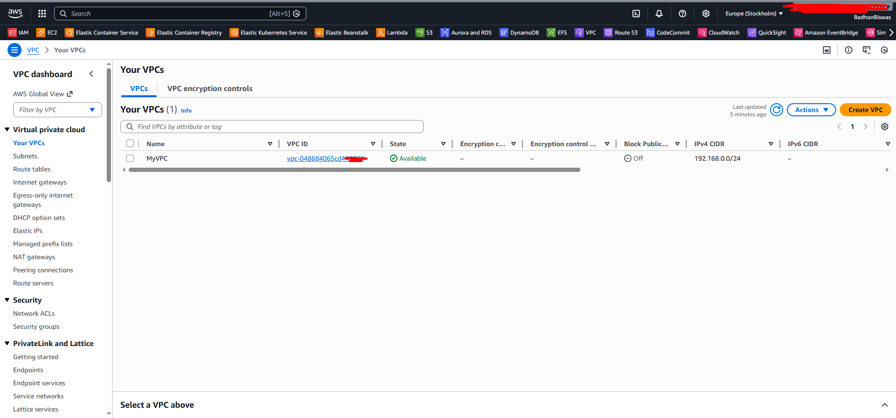
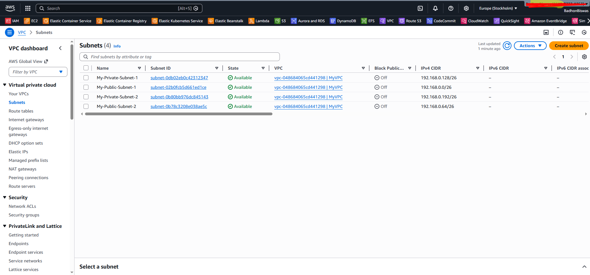
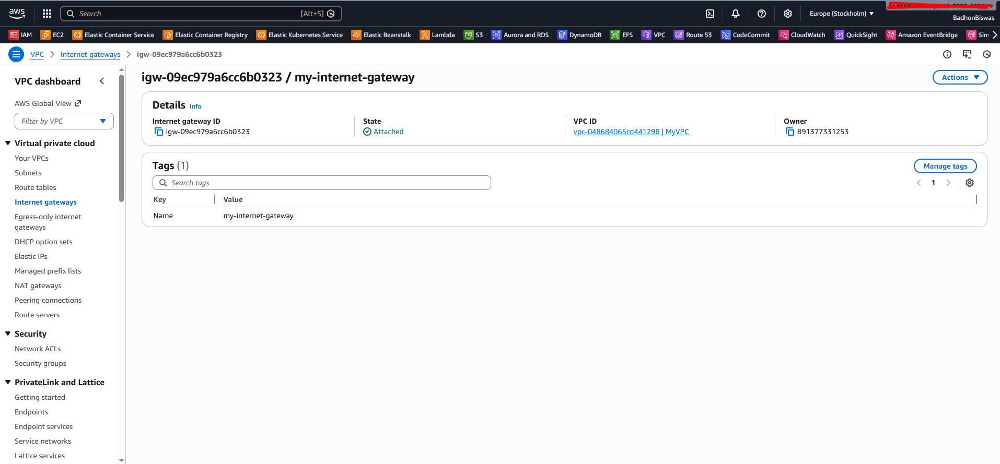
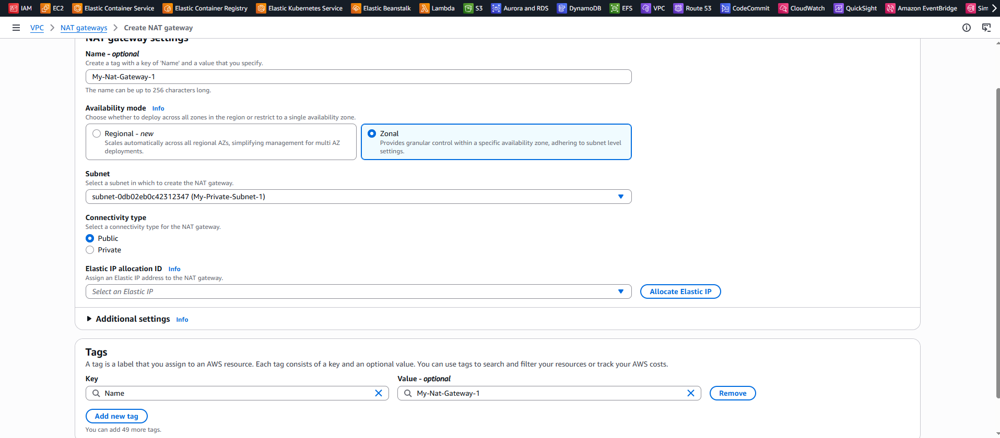
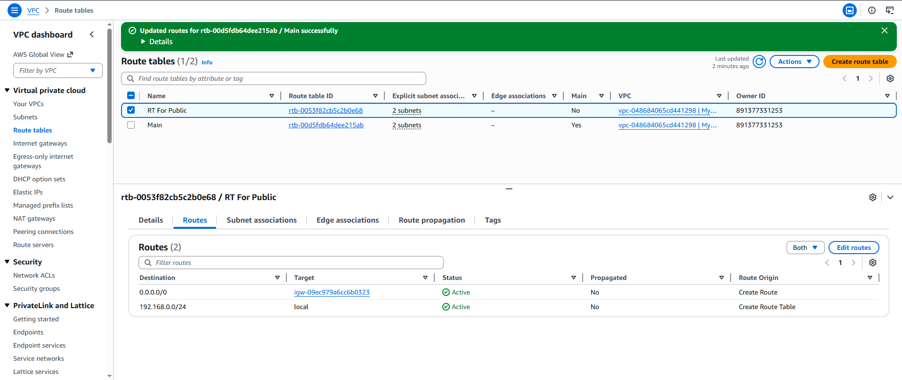
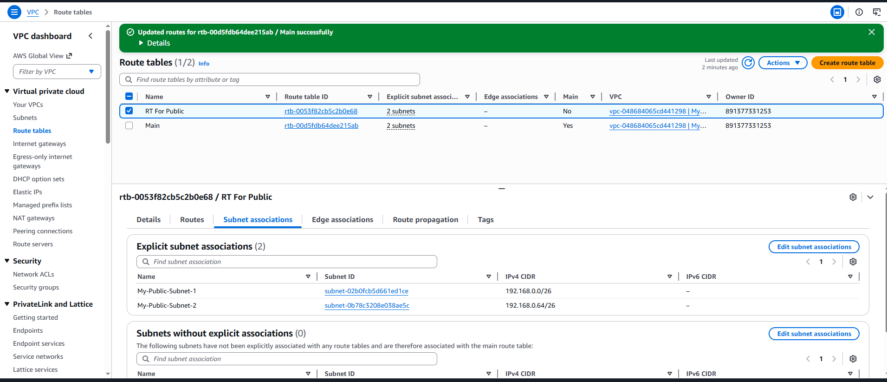
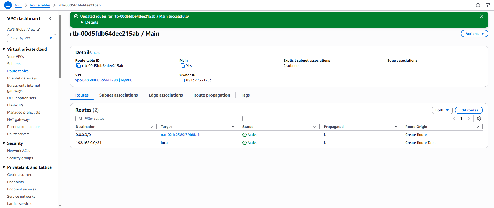
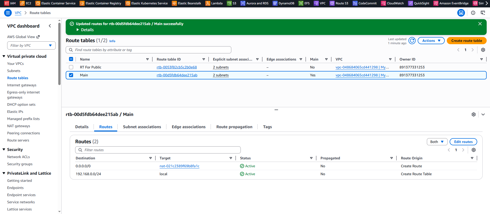
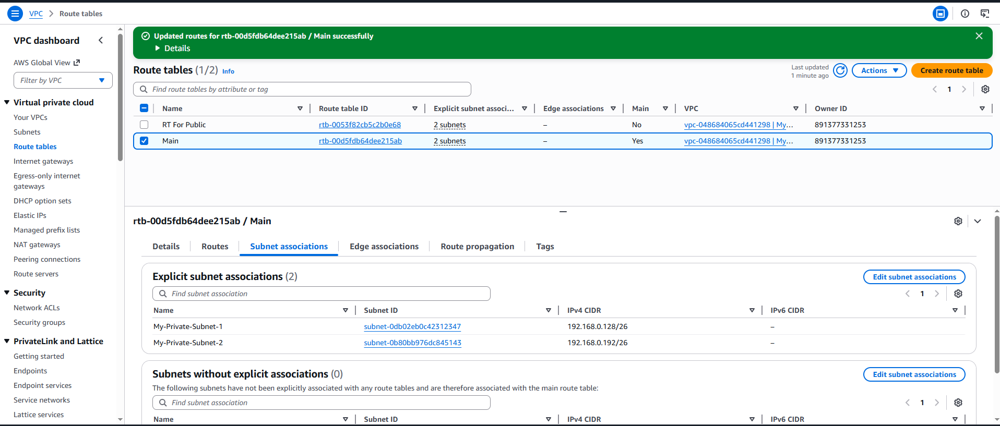

# AWS VPC & Load Balancer Architecture (Production Grade Setup)

## Project Overview

This project demonstrates the design and implementation of a **highly available, secure, and scalable AWS network architecture** using:

- Custom VPC
- Multi-AZ deployment
- Public & Private subnets
- Internet Gateway
- NAT Gateway
- Route Tables
- Application Load Balancer

This setup follows **AWS Well-Architected Framework best practices** and is suitable for **production environments**.

---

## Architecture Diagram

### Key Design Highlights
- **Region:** ap-south-1 (Mumbai)
- **VPC CIDR:** 192.168.0.0/24
- **Availability Zones:** ap-south-1a, ap-south-1b
- **High Availability:** Multi-AZ design
- **Security:** Private subnets for backend resources

---

## Step 1: VPC Creation

### Configuration
- CIDR Block: `192.168.0.0/24`
- DNS Hostnames: Enabled
- DNS Resolution: Enabled

This VPC serves as the isolated network environment for all resources.

---

## Step 2: Subnet Design

### Subnet Layout

| Subnet Name | Availability Zone | CIDR |
|--------------|-------------------|--------|
| Public_Subnet_1A | ap-south-1a | 192.168.0.0/26 |
| Public_Subnet_2B | ap-south-1b | 192.168.0.64/26 |
| Private_Subnet_1A | ap-south-1a | 192.168.0.128/26 |
| Private_Subnet_2B | ap-south-1b | 192.168.0.192/26 |

### Purpose
- **Public Subnets:** Load balancer, NAT gateway
- **Private Subnets:** Application servers

---

## Step 3: Internet Gateway

### Purpose
The Internet Gateway allows **public subnet resources** to communicate with the internet.

- Enables inbound traffic to Load Balancer
- Enables outbound traffic from public resources

---

## Step 4: NAT Gateway

### Purpose
Allows **private subnet instances** to access the internet securely **without exposing them publicly**.

### Use Cases
- Software updates
- Package installations
- External API access

---

## Step 5: Route Table – Public

### Routes

| Destination | Target |
|--------------|----------|
| 0.0.0.0/0 | Internet Gateway |

### Associated Subnets
- Public_Subnet_1A
- Public_Subnet_2B

---

## Step 6: Route Table – Private (Main)

### Routes

| Destination | Target |
|--------------|----------|
| 0.0.0.0/0 | NAT Gateway |

### Associated Subnets
- Private_Subnet_1A
- Private_Subnet_2B

---

## Step 7: Traffic Flow Explanation
