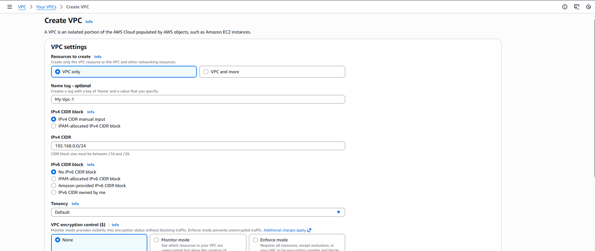
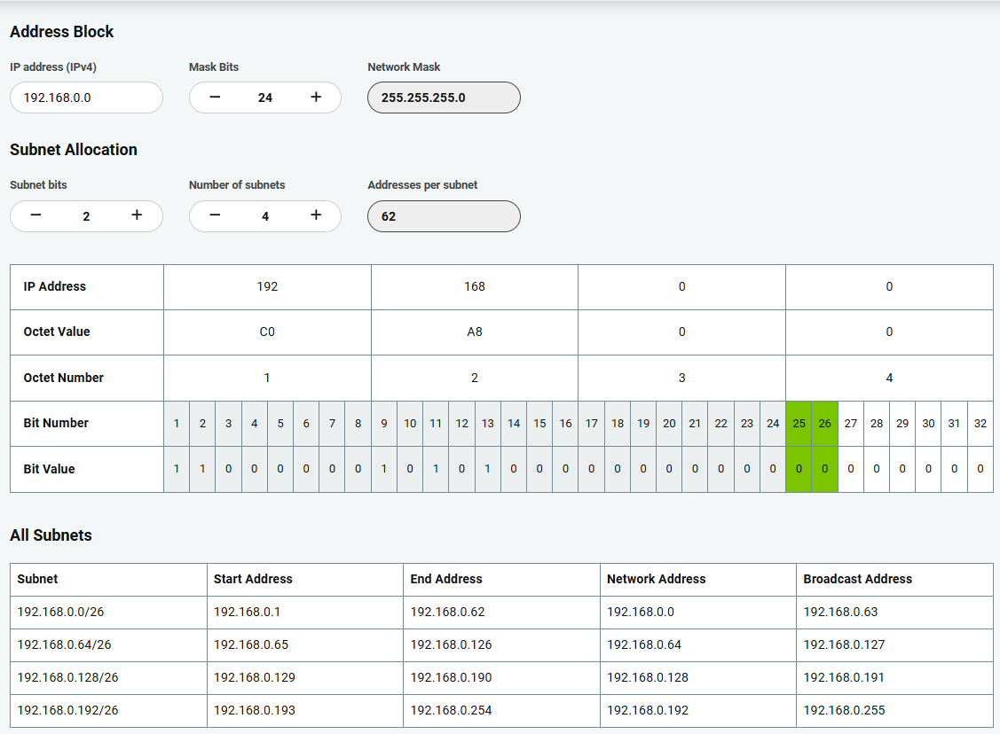
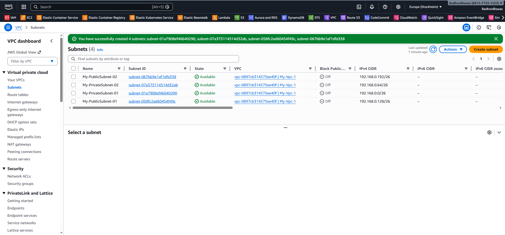
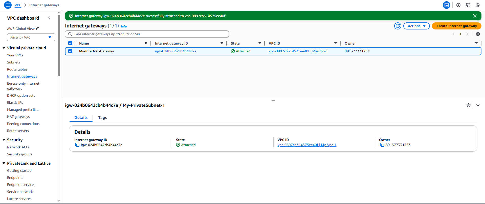
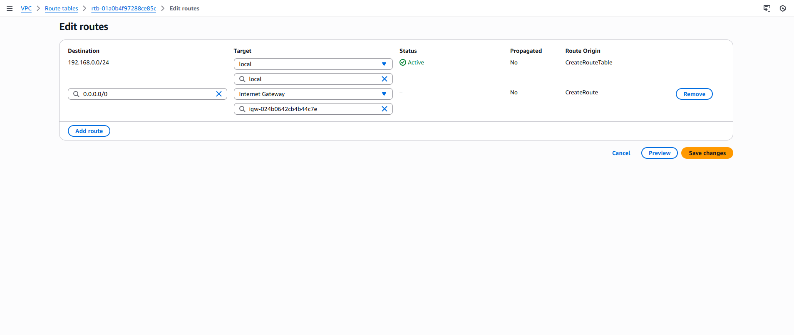

<!-- # Create A VPC

### 1. Create A VPC

- Create a VPC with the private Ip Address of 192.168.0.0/24
- IP Address: IP block for network partition 192.168.0.0/24



### 2. Assign Private Ip Address


- Like this 192.168.0.0/24

### 3. Create Subnet

- You can create 200 subnet in a single region
- but we want 4 subnet from this single vpc private ip address
- 
- We Will create 4 Subnet
  

### 4. Create a Internet Gateway

- 1. Create a Internet gateways then create with a name
- 2. Then Attached this VPC In the Internet Gateway
- 3. It will communicate with the Internet
- 

### 5. Last Create A Route Tables

- There will a Default Route Table
- In Routes tab -> Edit routes
    - Adding Destination to 0.0.0.00/0 to the Target InternetGateway
    - 
- Go to Subnet Associations tab
- Then Explicit subnet associations click (Edit subnet associations)
    - Add 2 Public subnet in this route table
-  -->

# AWS VPC Setup Guide

## 1. Create a VPC

Create a Virtual Private Cloud (VPC) with the following configuration:

- **Name:** My-VPC
- **IPv4 CIDR Block:** `192.168.0.0/24`
- **Tenancy:** Default

This CIDR block (`192.168.0.0/24`) defines the private IP range for the network.


---

## 2. Configure VPC CIDR Block

Ensure the VPC is assigned the private IP range:

```
192.168.0.0/24
```

This provides 256 total IP addresses (251 usable in AWS).


---

## 3. Create Subnets

AWS allows up to 200 subnets per VPC per region.  
For this setup, we will create **4 subnets** from the `192.168.0.0/24` network.

### Subnet Plan

| Subnet Name | CIDR Block       | Type    |
| ----------- | ---------------- | ------- |
| Public-1    | 192.168.0.0/26   | Public  |
| Public-2    | 192.168.0.64/26  | Public  |
| Private-1   | 192.168.0.128/26 | Private |
| Private-2   | 192.168.0.192/26 | Private |

Each `/26` subnet provides:

- 64 total IP addresses
- 59 usable IP addresses


---

## 4. Create and Attach an Internet Gateway

To enable internet access for public subnets:

1. Go to **Internet Gateways**
2. Click **Create Internet Gateway**
3. Provide a name (e.g., `My-IGW`)
4. Click **Attach to VPC**
5. Select your created VPC

This allows communication between the VPC and the internet.


---

## 5. Configure Route Tables

Every VPC has a default route table.  
We will modify it to allow internet traffic.

### Edit Routes

1. Go to **Route Tables**
2. Select your route table
3. Click **Routes → Edit Routes**
4. Add the following route:

| Destination | Target           |
| ----------- | ---------------- |
| `0.0.0.0/0` | Internet Gateway |

`0.0.0.0/0` allows outbound internet traffic.


---

### Associate Public Subnets

1. Go to **Subnet Associations**
2. Click **Edit Subnet Associations**
3. Select the **2 Public Subnets**
4. Save changes

Now:

- Public subnets have internet access
- Private subnets do not have direct internet access

---

## Final Architecture Summary

- 1 VPC (`192.168.0.0/24`)
- 4 Subnets (2 Public, 2 Private)
- 1 Internet Gateway
- 1 Route Table with Internet Route
- Public subnets associated with Internet Gateway

---
