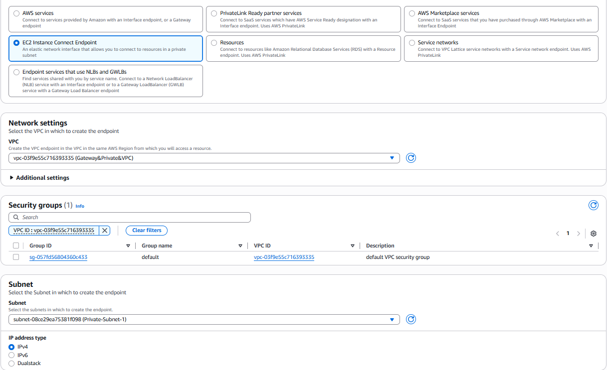
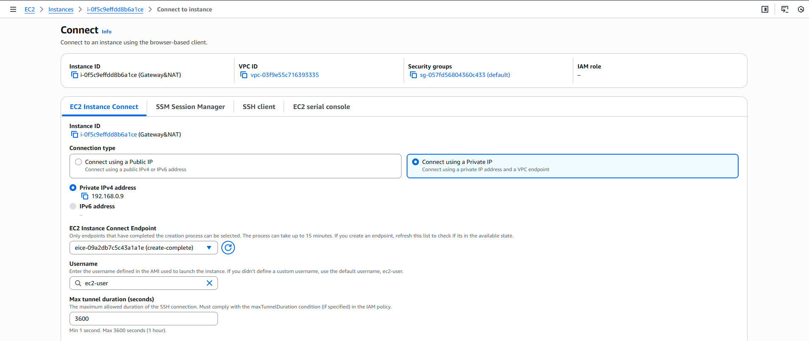
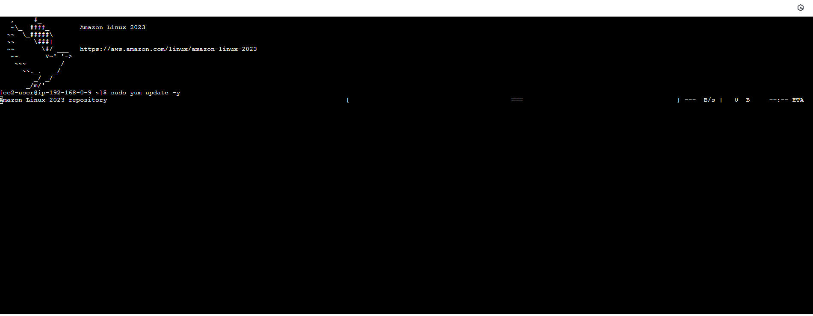
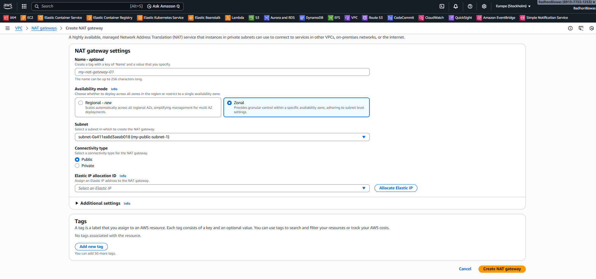
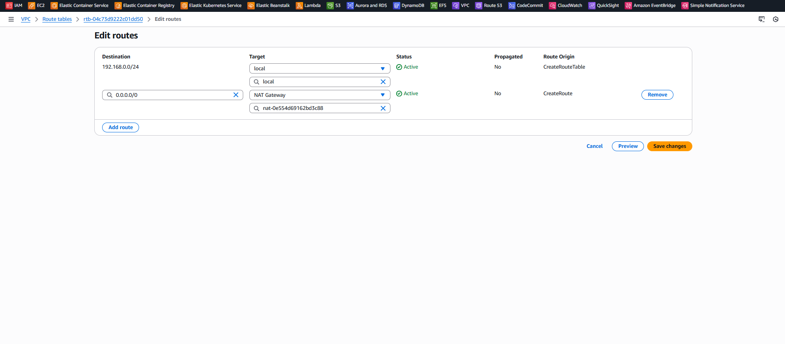

# Day 2

# Access Private EC2 Using VPC Endpoint

In this lab, we will access a **Private EC2 instance** using a **VPC Endpoint** without assigning a public IP address.

---

## Step 1: Create a VPC Endpoint

To securely access private resources inside the VPC:

1. Go to **VPC**
2. Select **Endpoints**
3. Click **Create Endpoint**
4. Choose the required service (e.g., EC2 Instance Connect Endpoint)
5. Select your VPC
6. Select the appropriate Subnet and Security Group
7. Click **Create Endpoint**



---

## Step 2: Connect to Private EC2 Using Private IP

After creating the endpoint:

1. Go to **EC2 Dashboard**
2. Select your **Private EC2 Instance**
3. Click **Connect**
4. Choose **EC2 Instance Connect**
5. Use the **Private IP Address** to connect

This allows you to access the instance without a public IP.



---

## Step 3: Private EC2 Dashboard Access

Once connected successfully, you will see the instance dashboard or terminal access.



---

## Summary

- Created a VPC Endpoint
- Connected to a Private EC2 instance
- Accessed the server using Private IP
- No Public IP was required

---

# Connect Private EC2 Using NAT Gateway

In this setup, we allow a **Private EC2 instance** to access the internet using a **NAT Gateway**.  
The EC2 instance will not have a public IP address.

---

## Architecture Overview

- 1 VPC
- 2 Public Subnets
- 2 Private Subnets
- 1 Internet Gateway (IGW)
- 1 NAT Gateway (in Public Subnet)
- Private EC2 inside Private Subnet

---

## Step 1: Create a NAT Gateway

1. Go to **VPC**
2. Select **NAT Gateways**
3. Click **Create NAT Gateway**
4. Choose a **Public Subnet**
5. Allocate or select an **Elastic IP**
6. Click **Create NAT Gateway**

> Important: NAT Gateway must be created inside a **Public Subnet**.



---

## Step 2: Update Public Route Table

Ensure your Public Subnet route table contains:

| Destination | Target           |
| ----------- | ---------------- |
| `0.0.0.0/0` | Internet Gateway |

This allows NAT Gateway to access the internet.

---

## Step 3: Update Private Route Table

Now configure the Private Subnet route table:

1. Go to **Route Tables**
2. Select the **Private Route Table**
3. Click **Edit Routes**
4. Add:

| Destination | Target      |
| ----------- | ----------- |
| `0.0.0.0/0` | NAT Gateway |

This allows the Private EC2 to send outbound traffic through the NAT Gateway.



---

## Step 4: Launch Private EC2 Instance

1. Launch EC2
2. Select **Private Subnet**
3. Disable **Auto-assign Public IP**
4. Attach appropriate Security Group

---

## Step 5: Test Internet Access

Connect to the Private EC2 (via Bastion Host or EC2 Instance Connect Endpoint).

Run:

```bash
ping google.com
```

or

```bash
sudo yum update -y
```

If it works, NAT Gateway is configured correctly.

---

## Important Notes

- Private EC2 cannot receive inbound internet traffic.
- NAT Gateway allows **outbound internet only**.
- NAT Gateway must be in a Public Subnet.
- Elastic IP is required for NAT Gateway.

---

## Final Result

- Private EC2 has no Public IP
- Internet access works via NAT Gateway
- Secure architecture maintained

---
