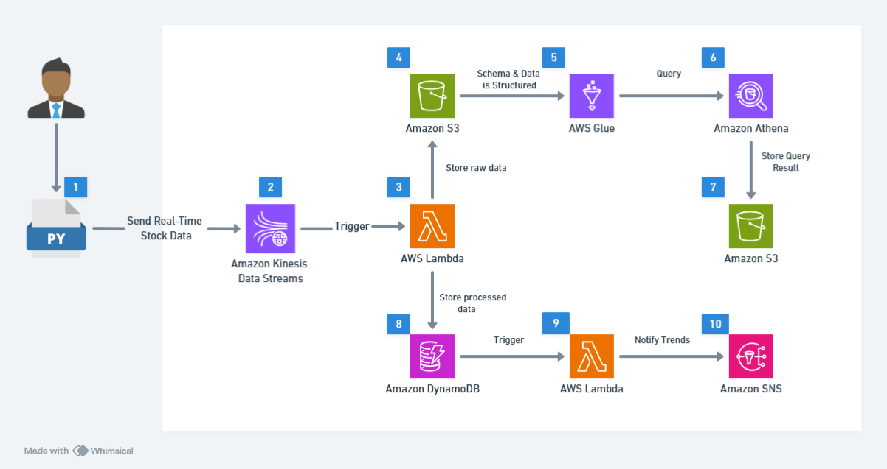

### Project Overview

- This project builds a real-time stock market data analytics pipeline using AWS, leveraging event-driven architecture and serverless technologies. The architecture ingests, processes, stores, and analyzes stock market data in real-time which minimizing costs

### Steps to be Performed

- In this video, We'll be going through the following steps.
  - [STEP 0: PreReq]:
    - Install Python and AWS CLI
    - Configure AWS CLI
    - Create a Role for LambdaFunction StockMarketLambdaRole
- 1. Setting Up Data Streaming with Amazon Kinesis
- 2. Processing Data with AWS Lambda
- 3. Query Historical Stock Data using Amazon Athena
- 4. Stack Trend Alerts using SNS

### Services Used

- **_Amazon Kinesis Data Streams_** : Ingests stock data in real-time.
- **_AWS Lambda_** : Processes stock data and detects stock trends.
- **_Amazon DynamoDB_** : Stores raw stack data for historical analysis
- **_Amazon Athena_** : Queries stock data directly from S3.
- **_Amazon SNS_** : Sends stock trend alerts via Email/SMS.
- **_IAM Roles & Policies_** : Manages permissions securely

### Architectural Diagram

- 1. A Python script continuously fetches real-time stock market data from APIs like yfinance and pushes it to Amazon Kinesis Data Streams
- 2. Amazon Kinesis Data Streams act as a real-time data pipeline.
- 3. AWS Lambda Function is triggered by kinesis to process, clean and transform the incomming data before storing in S3 and SynamoDB.
- 4. The raw stock data is stored in Amazon S3 for historical analysis.
- 5. AWS Glue Data Catalog crawls the raw data stored in S3, Creating a structured schema that scanables querying using Athena.
- 6. Amazon Athena, a serverless SQL query engine, runs analytical queries over the structured stock data via the Glue Data Catalog
- 7. Query results from Athena are stored in a dedicated S3 bucket.
- 8. Amazon DynamoDb stores processed stock data for real-time lookups
- 9. An AWS Lambda function analyzes real-time stock trends by computing moving sverages (SMA-5 and SMA-20) and detecting potential by/sell signals

### Final Result

Final Result

- A fully functional near real-time stock analytics pipeline built using AWS services, featuring.
- Event-driven architecture with Amazon Kinesis for real-time data ingesting
- Lambda-based anamaly detecting and stock trend evalution
- Low-latency storage in DynamoDB for fast access to processed data
- Historical Data archiving in Amazon S3 and querying via Athena.
- Real-time alerts via Amazon SNS (Email/SMS) for significant stock movements
- Secure and Cost-optimized design using IAM and serverless technologies
