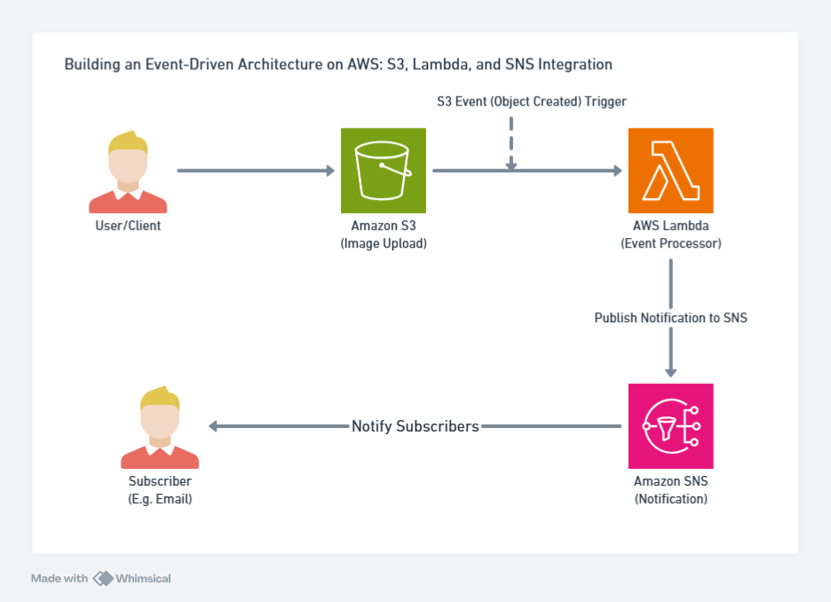
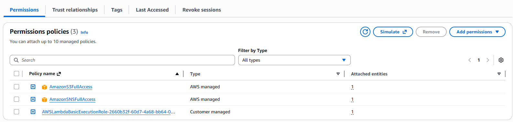
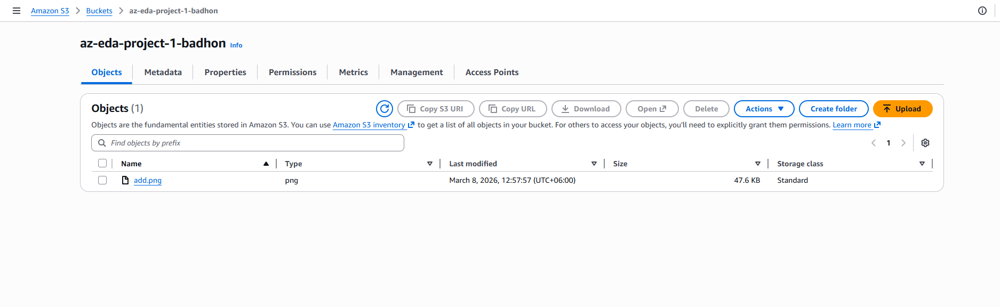
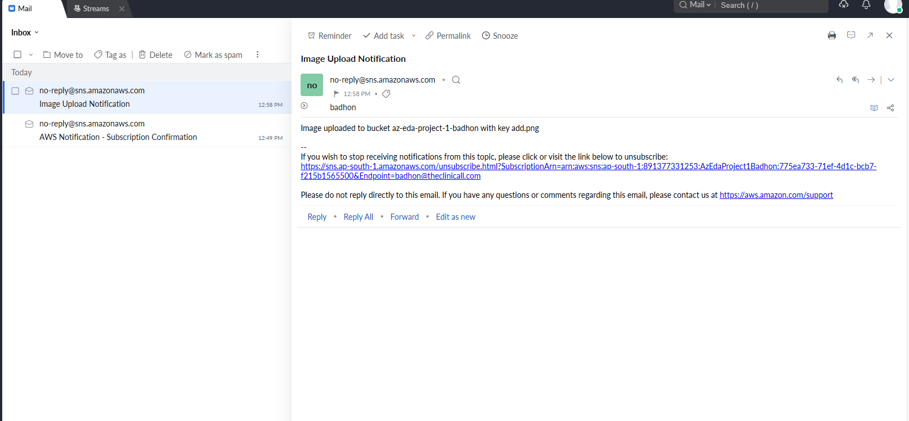

## Building an Event-Driven Architecture on AWS: S3, Lambda, and SNS Integration



### Steps to Build the Project

- Create an S3 Bucket (S3 Bucket Name: az-eda-project-1-badhon)
- Create an SNS Topic (SNS Topic Name: azEdaProject1Topic)
- Create a Subscription - Attach your email
- Create a Lambda Function (Lambda Function Name: AzEdaProject1Function)
- Add S3 Trigger
- Write lambda Function Code

```
import json
import boto3

def lambda_handler(event, context):
    sns_client = boto3.client('sns')
    topic_arn = 'arn:aws:sns:your-region:your-account-id:ImageUploadNotification'

    # Parse the S3 event
    for record in event['Records']:
        bucket = record['s3']['bucket']['name']
        key = record['s3']['object']['key']
        message = f'Image uploaded to bucket {bucket} with key {key}'

        # Publish message to SNS
        sns_client.publish(
            TopicArn=topic_arn,
            Message=message,
            Subject='Image Upload Notification'
        )

    return {
        'statusCode': 200,
        'body': json.dumps('Notification sent successfully!')
    }


# Replace your-region, your-account-id, and ImageUploadNotification with appropriate values from your SNS topic.
```

- Add this code then add permission
  - AmazonS3FullAccess
  - AmazonSNSFullAccess
  - 

- Test the System
  
- Email Notification Send
  
