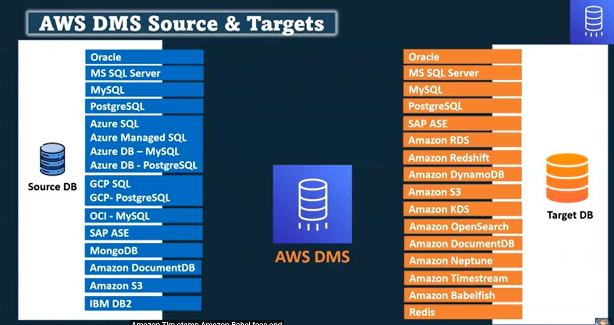
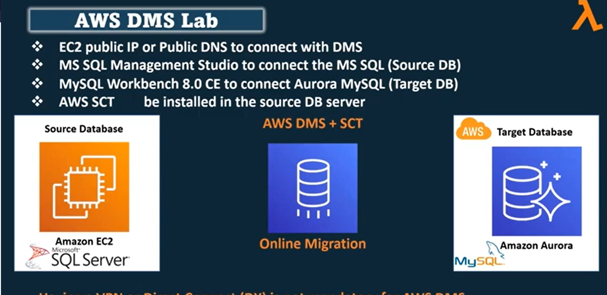

## Database Migration

- **Homogeneous Migration**
  - Source DB Engine = Target DB Engine
- **Heterogeneous Migration**
  - Source DB Engine !== Target DB Engine
  - So in this case we need AWS DMC + SCT

## AWS DMS Source & Targets Image



## Migration Modes

- **Online Migration**
  - Continuously migrating the database
- **Offline Migration**
  - Off the Database and then migrating the database

- AWS DMS Lab:
  - EC2 public IP or Public DNS to connect with DMS
  - MS SQL Management Studio to connect the MS SQL (Source DB)
  - MS SQL Workbench 8.0 CE to connect Auroro MySQl (Target DB)
  - AWS SCT will be installed in the DB server
    

- After Set up the SQL in EC2 and My SQL Workbench

```sql
CREATE USER 'badhon'@'%' IDENTIFIED BY 'Admin123#';
GRANT ALL PRIVILEGES ON *.* TO 'badhon'@'%' WITH GRANT OPTION;
FLUSH PRIVILEGES;
```

After that ann this script

```sql
--Set master database context
use [master]
GO


--Add the awssct login to the sysadmin server role - required for replication
ALTER SERVER ROLE [sysadmin] ADD MEMBER [dbadmin]
GO

--Set the recovery model to full for dms_sample - required for replication
ALTER DATABASE [dms_sample] SET RECOVERY FULL WITH NO_WAIT
GO

--Configure this SQL Server as its own distributor
exec sp_adddistributor @distributor = @@SERVERNAME, @password = N'Password1'
exec sp_adddistributiondb @database = N'distribution', @data_folder = N'C:\Program Files\Microsoft SQL Server\MSSQL16.MSSQLSERVER\MSSQL\DATA', @log_folder = N'C:\Program Files\Microsoft SQL Server\MSSQL16.MSSQLSERVER\MSSQL\DATA', @log_file_size = 2, @min_distretention = 0, @max_distretention = 72, @history_retention = 48, @security_mode = 1
GO

RECONFIGURE
go 

--Change context to the distribution database
use [distribution] 
GO

--Configure replication
if (not exists (select * from sysobjects where name = 'UIProperties' and type = 'U ')) 
	create table UIProperties(id int) 

if (exists (select * from ::fn_listextendedproperty('SnapshotFolder', 'user', 'dbo', 'table', 'UIProperties', null, null))) 
	EXEC sp_updateextendedproperty N'SnapshotFolder', N'C:\Program Files\Microsoft SQL Server\MSSQL16.MSSQLSERVER\MSSQL\repldata', 'user', dbo, 'table', 'UIProperties' 
else 
	EXEC sp_addextendedproperty N'SnapshotFolder', N'C:\Program Files\Microsoft SQL Server\MSSQL16.MSSQLSERVER\MSSQL\repldata', 'user', dbo, 'table', 'UIProperties'
GO

RECONFIGURE
go 

exec sp_adddistpublisher @publisher = @@SERVERNAME, @distribution_db = N'distribution', @security_mode = 1, @working_directory = N'C:\Program Files\Microsoft SQL Server\MSSQL16.MSSQLSERVER\MSSQL\repldata', @trusted = N'false', @thirdparty_flag = 0, @publisher_type = N'MSSQLSERVER'
GO


--- Now let us enable MS-CDC for non primary key tables
	USE dms_sample;
GO

EXEC sys.sp_cdc_enable_db
GO 

EXECUTE sys.sp_cdc_enable_table
    @source_schema = N'dbo',
    @source_name = N'mlb_data',
    @role_name = N'dbadmin';
GO
EXECUTE sys.sp_cdc_enable_table
    @source_schema = N'dbo',
    @source_name = N'nfl_data',
    @role_name = N'dbadmin';
GO
EXECUTE sys.sp_cdc_enable_table
    @source_schema = N'dbo',
    @source_name = N'nfl_stadium_data',
    @role_name = N'dbadmin';
GO
EXECUTE sys.sp_cdc_enable_table
    @source_schema = N'dbo',
    @source_name = N'corp_customers',
    @role_name = N'dbadmin';
GO
EXECUTE sys.sp_cdc_enable_table
    @source_schema = N'dbo',
    @source_name = N'product_sale_regions',
    @role_name = N'dbadmin';
GO
EXECUTE sys.sp_cdc_enable_table
    @source_schema = N'dbo',
    @source_name = N'product_sales',
    @role_name = N'dbadmin';
GO
EXECUTE sys.sp_cdc_enable_table
    @source_schema = N'dbo',
    @source_name = N'student_results',
    @role_name = N'dbadmin';
GO

ALTER DATABASE [YoDA] SET RECOVERY FULL WITH NO_WAIT
GO

```