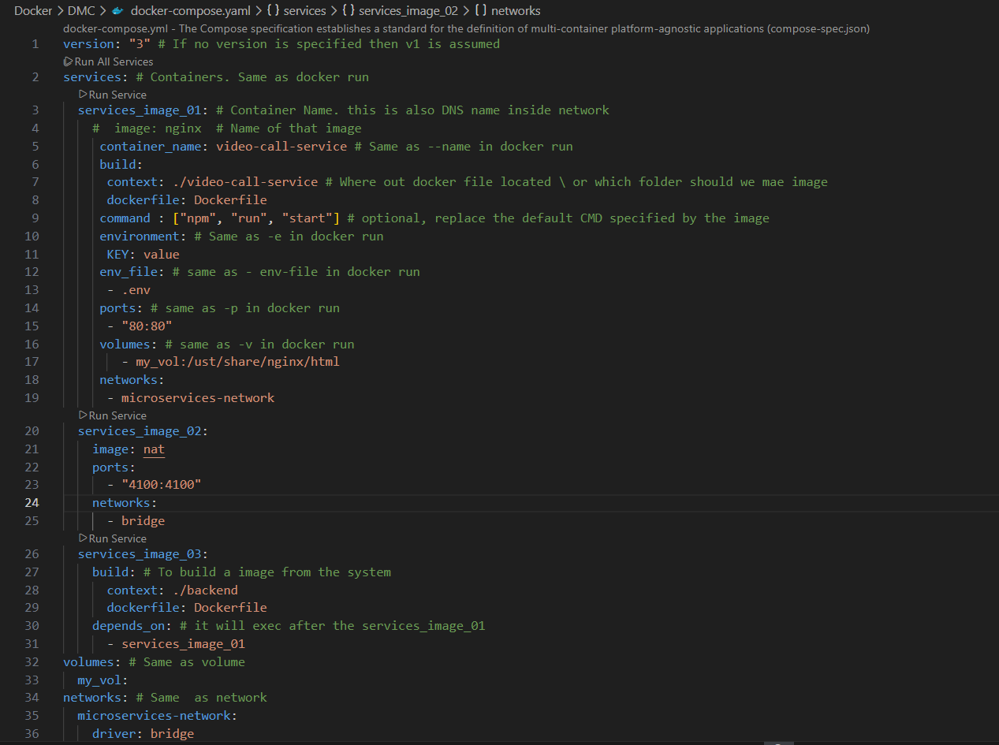

## Docker Compose

- Docker Compose is a tool for defining and running multi-container applications as a single service.
- For Example, an application requires both wordpress and mysql containers, you would create one file which would start both the containers as a service (docker compose)
- It simplifies the control of you entire application stack, making it easy to manage services, networks, and volumes in a single, comprehensible YAML configuration file
- THen, with a single command, you create and start all the services from your configuration file

- V1 Docker compose command
  - docker-compose
- V2 Docker Compose command
  - docker compose
  - docker-compose
- Docker Compose syntax
  - docker compose [option] command

- **Docker Compose Syntax**
  

- To build Only Image : docker compose build
- Build & Deploy : docker-compose up -d
- To Delete and Down the image : docker compose down --rmi all
